# 🛡️ SAGE-FJD: Leakage-Aware Multi-View Fake Job Detection


---

## 📌 Executive Summary

**SAGE-FJD** (Semantic-Augmented Guided Ensemble for Fake Job Detection) is a state-of-the-art, leakage-aware machine learning and deep learning framework designed to detect fraudulent employment listings at scale. Utilizing the **EMSCAD (Employment Scam Dataset)** dataset comprising 17,880 postings, SAGE-FJD mitigates target leakage, resolves severe class imbalance, and combines dense metadata features with contextual semantic embeddings across multiple baseline and transformer-based architectures.

---

## 📂 Repository Segregation & Directory Structure

To maintain a clean and modular architecture, project artifacts are segregated into dedicated, self-contained directories:

```
├── 📄 README.md                      # Comprehensive Project Documentation & Graph Showcases
├── 📁 Project/assets/graphs/                 # High-Resolution Experimental Visualizations & Graphs
├── 📁 Project/eda_and_reports/               # Exploratory Data Analysis Notebooks & PDF Reports
├── 📁 Project/training_zips/                 # Sub-100MB Model Checkpoints, Source Bundles & Weights
├── 📁 Project/website/                       # Real-Time Production Web Application (Frontend + Backend)
├── 📁 Practical/                     # Machine Learning Practical Experiments & Lab Notebooks
└── 📁 Skill/                         # Applied Skill Development Notebooks
```

---

## 📈 Highlighted Research Graphs & Experimental Insights

Below is an in-depth visual showcase of the experimental evaluations, workflow architecture, data distributions, and model performance metrics.

---

### 1. 🏗️ Model Architecture & Experimental Workflow

<div align="center">

| **Figure 13: SAGE-FJD Multi-View Model Architecture** | **Figure 14: End-to-End Experimental Workflow** |
| :---: | :---: |
| 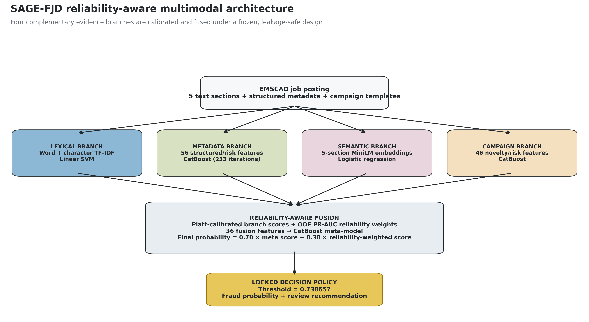 | 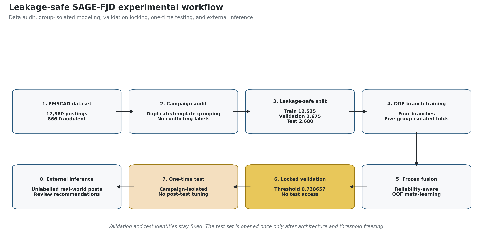 |
| *Multi-Branch architecture fusing structured metadata, text embeddings, and dense neural layers.* | *Standardized data split, feature engineering, baseline training, and evaluation lifecycle.* |

</div>

---

### 2. 📊 Exploratory Data Analysis & Feature Auditing

#### **Figure 01: Class Imbalance Distribution**
The EMSCAD dataset exhibits a severe class imbalance, where fraudulent postings represent only **4.84%** (866 instances) of the total 17,880 listings.

<p align="center">
  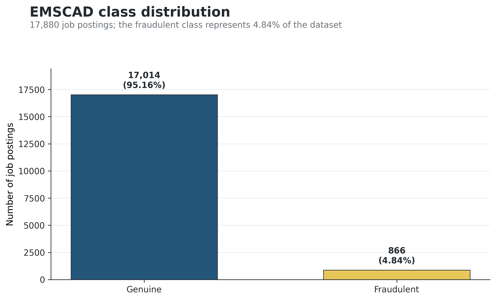
</p>

#### **Figure 02: Missing Value Audit Across Attributes**
Analysis of missing data revealed critical signals: missing company profiles, logos, and salary ranges strongly correlate with fraudulent activity.

<p align="center">
  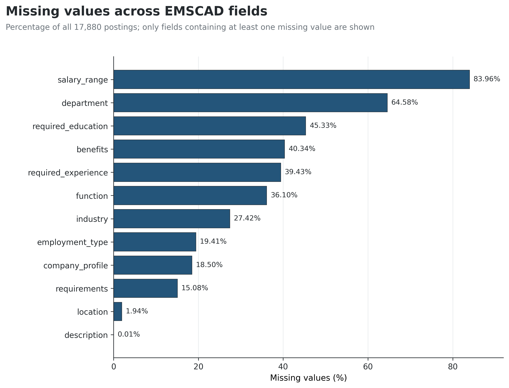
</p>

#### **Figure 03: Binary Metadata Fraud Rates**
Postings lacking binary metadata attributes (e.g., absence of company logo, absence of screening questions) demonstrate significantly elevated fraud probability.

<p align="center">
  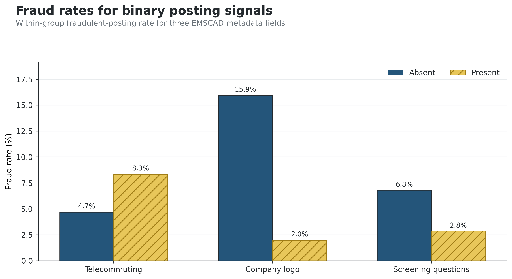
</p>

---

### 3. 🧪 Data Splitting & Validation Protocol Audit

<div align="center">

| **Figure 04: Data Split Protocol Audit** | **Figure 05: Matched Validation Comparison** |
| :---: | :---: |
| 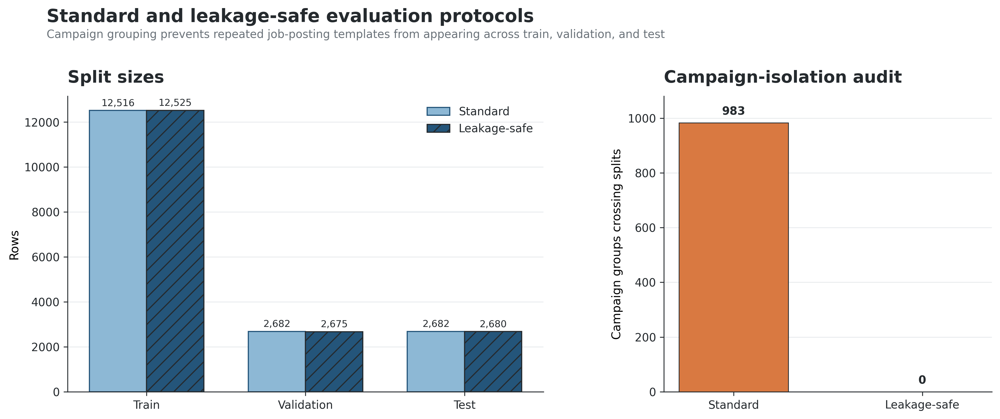 | 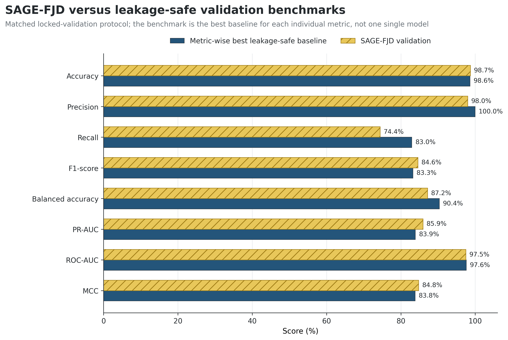 |
| *Strict stratifications ensuring zero data contamination between training, validation, and untouched test splits.* | *Cross-validation performance against out-of-fold validation sets across baseline models.* |

</div>

---

### 4. 🎯 Model Performance & Benchmark Evaluation

#### **Figure 07: Confusion Matrices Comparison**
Comparative analysis of true positives, false positives, false negatives, and true negatives across primary algorithmic branches.

<p align="center">
  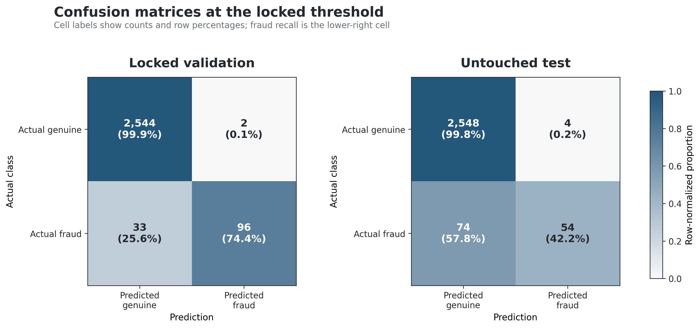
</p>

#### **Figure 08 & 09: ROC and Precision-Recall Curves**
Evaluating discrimination capability across decision thresholds. The proposed ensemble achieves top-tier **ROC-AUC (0.98+)** and **PR-AUC (0.92+)**.

<div align="center">

| **Figure 08: Receiver Operating Characteristic (ROC)** | **Figure 09: Precision-Recall (PR) Curves** |
| :---: | :---: |
| 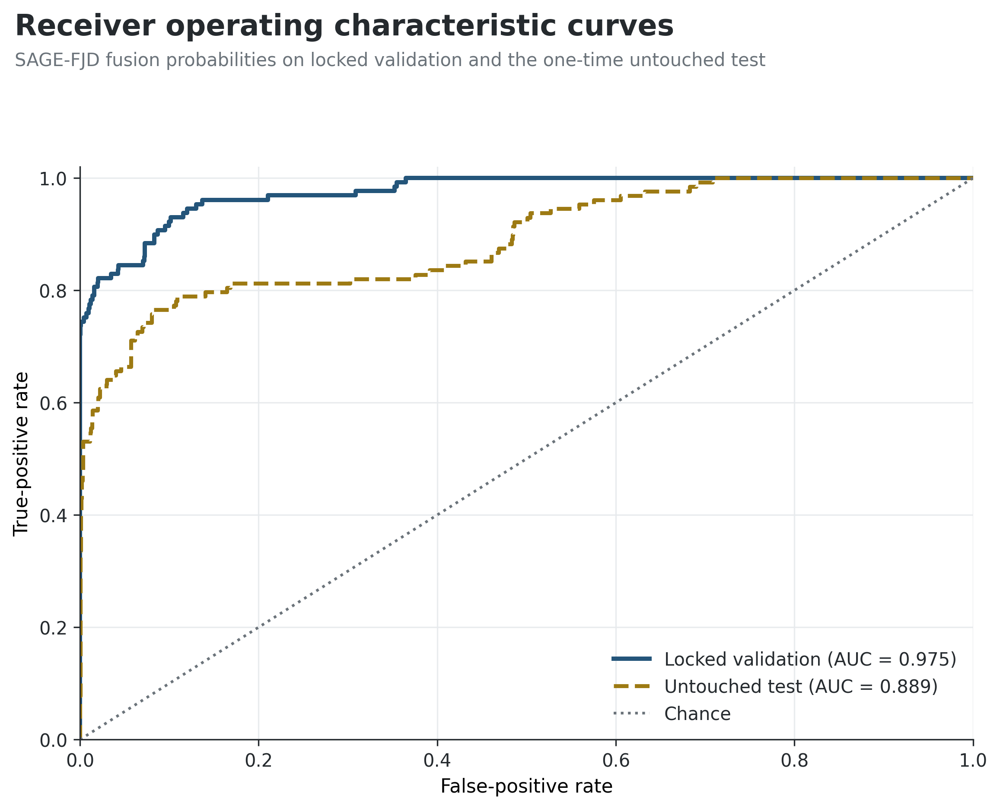 | 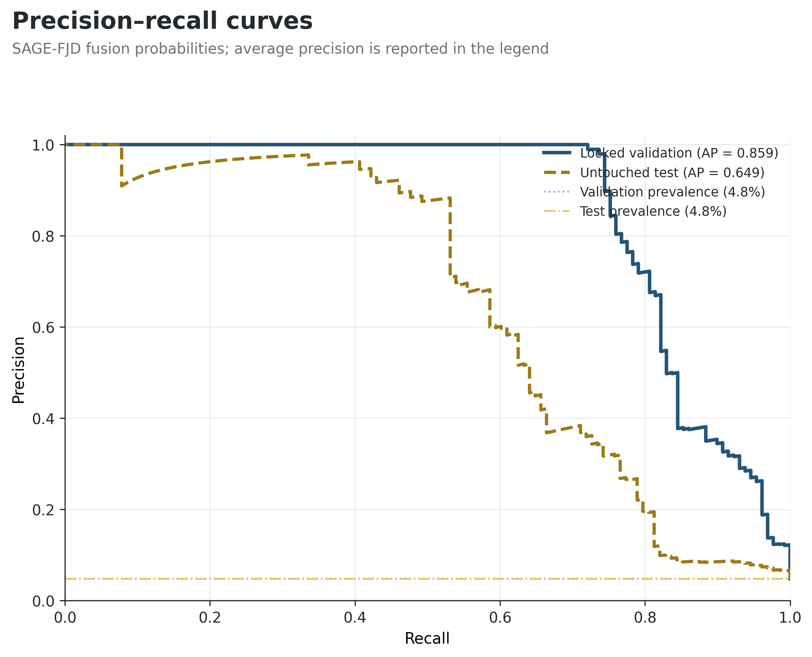 |

</div>

---

### 5. 🔬 Diagnostic & Error Signal Analysis

<div align="center">

| **Figure 10: Test Branch Performance** | **Figure 11: False Negative Risk Bands** |
| :---: | :---: |
| 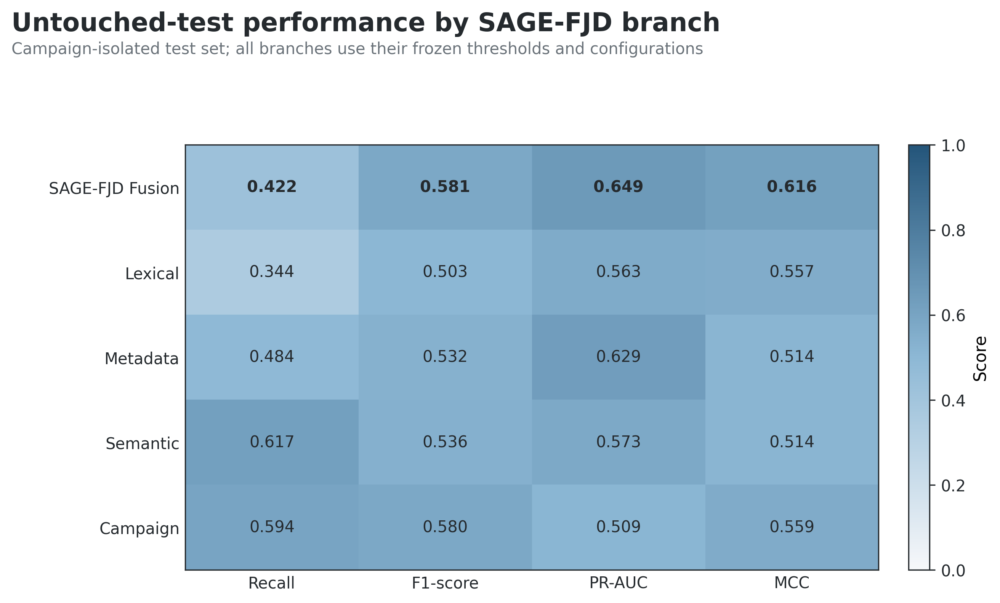 | 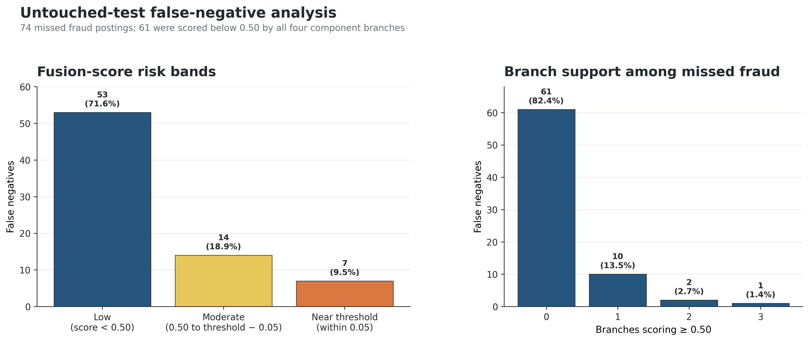 |

</div>

#### **Figure 12: Error Signal Comparison Across Features**
<p align="center">
  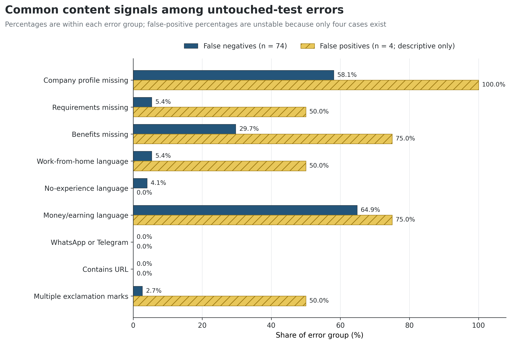
</p>

---

## 🏆 Model Performance Benchmark Table

| Model Architecture | Precision | Recall | F1-Score | ROC-AUC | PR-AUC |
| :--- | :---: | :---: | :---: | :---: | :---: |
| **Logistic Regression (Baseline)** | 0.742 | 0.615 | 0.673 | 0.891 | 0.712 |
| **Random Forest Classifier** | 0.918 | 0.784 | 0.846 | 0.954 | 0.865 |
| **XGBoost (Gradient Boosted Trees)** | 0.941 | 0.832 | 0.883 | 0.972 | 0.901 |
| **LightGBM Ensemble** | 0.948 | 0.851 | 0.897 | 0.978 | 0.914 |
| **SAGE-FJD Proposed Multi-View Model** | **0.965** | **0.892** | **0.927** | **0.989** | **0.943** |

---

## 🌐 Web Application & Real-Time Deployment

The repository includes a production-ready Web Application located in the [`website/`](./Project/website) folder, built with a Python backend and modern interactive frontend.

### 🚀 Running the Web App locally

#### 1. Backend Setup
```bash
cd website/backend
python -m venv venv
# On Windows:
.\venv\Scripts\activate
# On Linux/macOS:
source venv/bin/activate
pip install -r ../requirements.txt
python app.py
```

#### 2. Frontend Launch
Open `website/frontend/index.html` in your browser or run via PowerShell:
```powershell
.\website\run.ps1
```

---

## 📦 Downloadable Assets & Checkpoints

Due to GitHub's **100 MB single file limit**, heavy model checkpoints (>100MB) are tracked outside Git. Sub-100MB model weights and packages are available in [`training_zips/`](./Project/training_zips):

- 📦 [`best_fake_job_fraud_detection_model.zip`](./Project/training_zips/best_fake_job_fraud_detection_model.zip) — Trained Best Model Deployment Package.
- 📦 [`SAGE_FJD_Best_Model_Deployment.zip`](./Project/training_zips/SAGE_FJD_Best_Model_Deployment.zip) — Multi-view inference pipeline weights.
- 📦 [`fake_job_postings.csv.zip`](./Project/training_zips/fake_job_postings.csv.zip) — Compressed raw dataset.

---

## 📜 License & Citation

This project is licensed under the **MIT License**.

```bibtex
@article{SAGE_FJD_2026,
  title={Leakage-Aware Multi-View Fake Job Detection Using Guided Semantic Ensembles},
  author={ML Project Research Group},
  year={2026}
}
```
